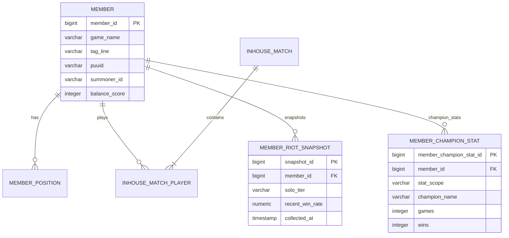

# Rift Arena 2차 ERD

```mermaid
erDiagram
 MEMBER ||--o{ MEMBER_POSITION : has
 MEMBER ||--o{ INHOUSE_MATCH_PLAYER : plays
 INHOUSE_MATCH ||--|{ INHOUSE_MATCH_PLAYER : contains
 MEMBER ||--o{ MEMBER_RIOT_SNAPSHOT : snapshots
 MEMBER ||--o{ MEMBER_CHAMPION_STAT : champion_stats
 MEMBER { bigint member_id PK varchar game_name varchar tag_line varchar puuid varchar summoner_id integer balance_score }
 MEMBER_RIOT_SNAPSHOT { bigint snapshot_id PK bigint member_id FK varchar solo_tier numeric recent_win_rate timestamp collected_at }
 MEMBER_CHAMPION_STAT { bigint member_champion_stat_id PK bigint member_id FK varchar stat_scope varchar champion_name integer games integer wins }
```

`SYNERGY`는 별도 테이블에 중복 저장하지 않고 `INHOUSE_MATCH_PLAYER`를 자기조인하여 실시간 계산합니다.
