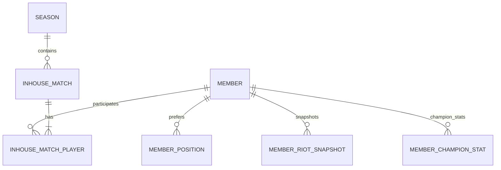

# Rift Arena v2.2 ERD

```mermaid
erDiagram
    MEMBER ||--o{ MEMBER_POSITION : prefers
    MEMBER ||--o{ INHOUSE_MATCH_PLAYER : participates
    SEASON ||--o{ INHOUSE_MATCH : contains
    INHOUSE_MATCH ||--|{ INHOUSE_MATCH_PLAYER : has
    MEMBER ||--o{ MEMBER_RIOT_SNAPSHOT : snapshots
    MEMBER ||--o{ MEMBER_CHAMPION_STAT : champion_stats
```

핵심 변경점은 `SEASON 1:N INHOUSE_MATCH` 관계입니다. 궁합·상대전적·어워드는 경기 원장으로 실시간 계산하며 별도 중복 집계 테이블을 만들지 않습니다.
